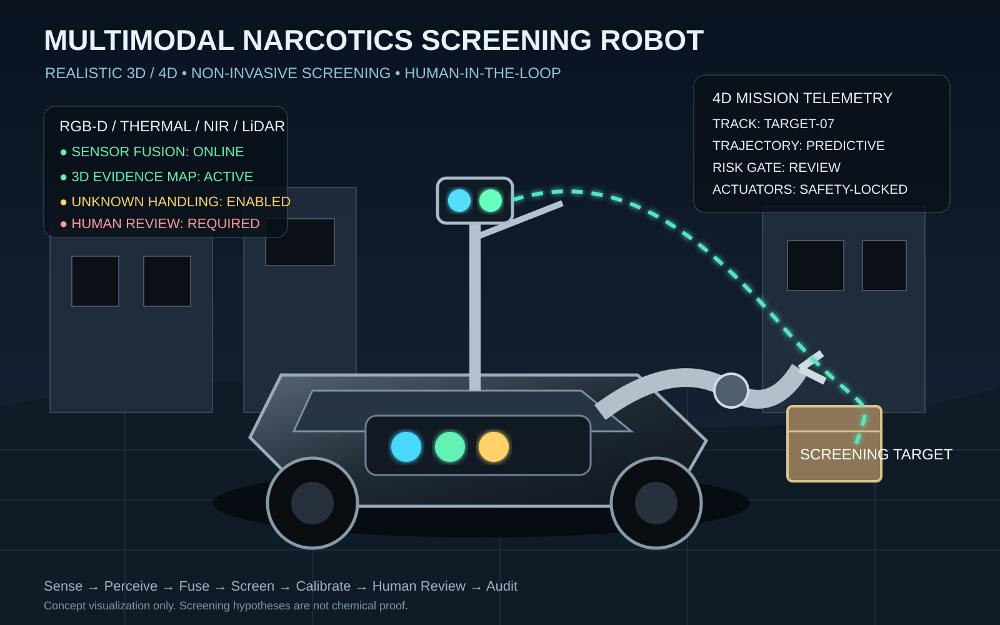

# Multimodal Narcotics Screening Robot


## PUI89 AI Robotics Platform

**Multimodal AI security and inspection platform with evidence-aware screening, uncertainty and human review.**

This repository is one vertical implementation of the **PUI89 AI Robotics** platform for security / inspection. The common architecture is:

```text
Multimodal Sensors
      ↓
Quality / Health Gate
      ↓
Perception + Tracking
      ↓
3D / 4D World Model
      ↓
Uncertainty + OOD
      ↓
Foundation-Model Reasoning
      ↓
Task Planning
      ↓
Deterministic Safety Supervisor
      ↓
ROS 2 / Robot Control
      ↓
Telemetry / Evidence
      ↓
MLOps / Fleet Learning
```

### Product tiers

- **PUI89 Research** — universities, robotics competitions, researchers
- **PUI89 Professional** — industrial customers, logistics, ports, infrastructure, authorized security operators
- **PUI89 Enterprise** — large corporations, governments, logistics, ports, infrastructure

### Cross-environment research

The same perception/world-model/uncertainty/safety interfaces are designed to transfer between agriculture, disaster response and security/inspection. Transfer must be measured with the repository benchmark; it is not assumed from architecture alone.

- [Optional DINOv2 + Anomalib integration, end-to-end verification and tests](docs/OPEN_SOURCE_VISION_INTEGRATION.md)
- [ROS 2 + Nav2 + Gazebo Sim + Open3D integration guide and environment preflight](docs/ROBOTICS_STACK_INTEGRATION.md)

### Evidence standard

This project separates **targets, prototypes and measured results**. Production or field-validation claims require reproducible benchmark evidence, failure testing, and documented safety validation.

See:
- [PUI89 Benchmark](docs/PUI89_BENCHMARK.md)
- [Cross-Environment Transfer Benchmark](docs/PUI89_TRANSFER_BENCHMARK.md)
- [Product Tiers](docs/PUI89_PRODUCT_TIERS.md)
- [Failure and UNKNOWN Protocol](docs/PUI89_FAILURE_AND_UNKNOWN_PROTOCOL.md)
- [MLOps Model Lifecycle](docs/PUI89_MLOPS_MODEL_LIFECYCLE.md)
- [Research, Competition and Commercial Evidence](docs/PUI89_RESEARCH_COMPETITION_INVESTOR.md)
- [12-Month Roadmap](docs/PUI89_12_MONTH_ROADMAP.md)

Defensive, non-invasive AI platform for screening accessible external objects and environments for anomalous substances and suspected narcotics-related visual patterns, with multimodal evidence fusion, uncertainty handling, human review, and safe robotics integration.

SAFETY: ordinary cameras, thermal/NIR, depth, LiDAR, and AI models cannot reliably identify a drug hidden inside a person's organs or determine whether someone has ingested a substance. This project does not perform internal-body diagnosis, medical examination, forensic chemical identification, restraint, seizure, or autonomous enforcement. Suspected ingestion/internal-body cases require qualified medical/forensic professionals using validated procedures.

## Stack

- RGB/RGB-D/thermal/NIR/LiDAR perception
- YOLO-family detection, SAM3-style segmentation, tracking
- 3D localization and evidence geometry
- open-set anomaly and unknown handling
- Qwen3-VL and Gemma4-E4B-it as review aids
- V-JEPA2-style temporal representation
- ROS2/Nav2, LiDAR/depth/IMU SLAM, optional MPC
- MQTT/WebSockets telemetry
- Isaac Sim/Isaac Lab and LeRobot simulation hooks
- deterministic safety gate before robot motion

## Screening taxonomy

amphetamine, heroin, methamphetamine_crystal, narcotic_unknown, unknown_substance

Predictions are screening hypotheses only, never proof of chemical identity. Unknown and unseen observations remain unknown.

## Architecture

RGB/RGB-D/Thermal/NIR/LiDAR -> detection/segmentation/tracking -> 3D evidence fusion -> anomaly/unknown screening -> multimodal reasoning -> uncertainty calibration -> HUMAN REVIEW -> audit/evidence record.

Navigation is separate: LiDAR/Depth/IMU -> SLAM/local map -> Nav2/planner/MPC -> deterministic safety gate -> ROS2 controller. Foundation models never directly command motors.

## Quick start

python -m pip install -e '.[dev]'
pytest -q

## Executable End-to-End Baseline

The repository now contains an executable **software-level end-to-end reference pipeline**:

`normalized sensor observations → sensor-quality gate → temporal alignment → multimodal evidence aggregation → uncertainty/UNKNOWN abstention → mandatory human review → auditable evidence record`.

This is an integrated reference workflow, not yet proof that every physical sensor, foundation model, ROS 2 node, or robot actuator is integrated into one validated hardware system.

### Run it

```bash
python -m pip install -e '.[dev]'
pytest -q
```

Example using recorded or simulated observations:

```python
from pui89_e2e import EndToEndScreeningPipeline, SensorObservation

observations = [
    SensorObservation(
        sensor_id="camera-01",
        modality="rgb",
        timestamp="2026-10-09T10:00:00+00:00",
        quality=0.92,
        candidate_label="unknown_substance",
        confidence=0.0,
    ),
    SensorObservation(
        sensor_id="depth-01",
        modality="depth",
        timestamp="2026-10-09T10:00:00+00:00",
        quality=0.95,
        candidate_label="unknown_substance",
        confidence=0.0,
    ),
]

result = EndToEndScreeningPipeline().run(observations, case_id="demo-001")
print(result.to_dict())
```

The input observations above are illustrative test data, not live sensor readings or a validated narcotics detection result. The pipeline rejects poor-quality or temporally misaligned evidence, preserves UNKNOWN when no supported hypothesis exists, produces a traceable evidence ID and audit record, and always requires human review. It **never authorizes robot motion** and does not identify chemical composition.

Implementation: [`src/pui89_e2e/pipeline.py`](src/pui89_e2e/pipeline.py). Tests: [`tests/test_e2e_pipeline.py`](tests/test_e2e_pipeline.py).

## End-to-End Verification

The pipeline includes an independent verification function for evidence integrity and safety invariants. It checks the evidence ID against the recorded payload, consistency between output and audit fields, valid confidence/status/counts, preservation of UNKNOWN on abstention, mandatory human review, and that robot motion remains unauthorized.

```python
from pui89_e2e import verify_pipeline_result

report = verify_pipeline_result(result)
if not report.valid:
    print("Verification errors:", report.errors)
```

Run the automated suite with `pytest -q`. Verification tests include record tampering, attempted motion authorization, missing human review, and abstention checks.

Full details: [End-to-End Verification](docs/E2E_VERIFICATION.md).

**Security limitation:** the current evidence ID is an unkeyed digest for integrity consistency, not a cryptographic signature or proof of who created/reviewed a record. Passing software checks does not validate detection accuracy, chemical identity, or real-world robot safety.

## Ethics

Use only lawful, authorized and proportionate screening. Minimize retained imagery, protect evidence access, log reviewer decisions, and avoid demographic or unrelated person identification.

## 3D / 4D Robot Concept



Realistic concept visualization of the mobile screening robot, sensor mast, screening target, multimodal sensor fusion and time-indexed 4D trajectory. The visualization is a design concept, not a claim of chemical identification capability.

- [3D/4D concept image](docs/multimodal_narcotics_screening_robot_3d_4d_concept.svg)
- [3D/4D video preview](docs/multimodal_narcotics_screening_robot_3d4d_preview.mp4)

## Pipeline Overview

**Sense → Quality Gate → Perceive → Track → 3D Evidence Fusion → Anomaly/Unknown Screening → Multimodal Reasoning → Uncertainty Calibration → Human Review → Audit → Safe Robot Navigation**

See [Pipeline Overview](docs/PIPELINE_OVERVIEW.md) for the full safety-first workflow and [AI Architecture](docs/AI_ARCHITECTURE.md) for the multimodal system diagram.

> Safety note: screening outputs are hypotheses for authorized human review. They are not proof of chemical identity, and foundation models do not directly control robot motors.


## News

Project updates, releases, architecture changes, evaluation milestones, and safety-related changes will be documented in Git history and release notes. No experimental result is presented as validated until it has been reproduced and documented.

## Online API

**Status: Prototype / planned interface**

The intended API will expose screening and evidence-processing services without providing direct actuator control.

Example conceptual request:

~~~json
{
  "request_id": "example-001",
  "modalities": ["rgb", "depth", "thermal", "lidar"],
  "mode": "screening"
}
~~~

Example conceptual response:

~~~json
{
  "screening_hypothesis": "unknown_substance",
  "confidence": 0.0,
  "uncertainty": 0.0,
  "decision": "HUMAN_REVIEW",
  "evidence_provenance": {}
}
~~~

Values above are interface examples only, not measured results.

## Online App

**Status: Prototype / planned**

The planned web interface will provide:

- live sensor status
- synchronized RGB/depth/thermal/LiDAR views
- 3D evidence visualization
- uncertainty and OOD indicators
- screening history and audit trail
- human-review workflow
- robot telemetry
- safety-state and emergency-stop status

The application will not expose unrestricted AI-to-motor control.

## System Overview

~~~text
Sensors
  │
  ├── RGB / RGB-D
  ├── Thermal / NIR
  ├── LiDAR
  └── IMU
       │
       ▼
Sensor Synchronization + Quality Gate
       │
       ▼
Detection / Segmentation / Tracking
       │
       ▼
3D Evidence Fusion
       │
       ├──────────────► SLAM / Local Map ─► Planner
       │                                  │
       ▼                                  ▼
Open-Set / Anomaly Screening       Deterministic Safety Gate
       │                                  │
       ▼                                  ▼
Multimodal Reasoning                  ROS 2 Controller
       │
       ▼
Uncertainty / OOD Calibration
       │
       ▼
Human Review
       │
       ▼
Audit / Evidence Record
~~~

Foundation models remain advisory components and are isolated from direct actuator control.

## Model Variants and Input Specifications

The repository is designed to support modular model variants rather than requiring a single model.

| Variant | Primary inputs | Purpose | Status |
|---|---|---|---|
| RGB | RGB image | baseline visual perception | Prototype |
| RGB-D | RGB + depth | object geometry and localization | Prototype |
| Thermal/NIR | thermal/NIR | complementary spectral evidence | Planned |
| LiDAR | point cloud | 3D geometry and mapping | Prototype |
| Multimodal | RGB-D + thermal/NIR + LiDAR | evidence fusion | Prototype |
| Temporal | sequential multimodal observations | temporal evidence | Planned |
| Open-set | multimodal + OOD features | unknown handling | Prototype |
| Review model | multimodal evidence | human-review assistance | Prototype |

Input specifications should be treated as hardware/configuration dependent. Sensor calibration, synchronization, resolution, frame rate, field of view, and preprocessing must be recorded for each deployment.

## Model Architecture

The architecture separates perception, evidence fusion, reasoning, uncertainty estimation, and robot control:

~~~text
RGB/RGB-D ───────┐
Thermal/NIR ─────┤
LiDAR ───────────┤
IMU ─────────────┘
        │
        ▼
Quality Gate
        │
        ▼
Perception
(detection / segmentation / tracking)
        │
        ▼
Multimodal Evidence Fusion
        │
        ├──► Open-Set / OOD
        ├──► Temporal Representation
        └──► 3D Evidence Map
        │
        ▼
Reasoning / Evidence Summary
        │
        ▼
Uncertainty Calibration
        │
        ▼
Human Review
        │
        ▼
Audit Record

Navigation:
LiDAR + Depth + IMU
        │
        ▼
SLAM → Local Map → Planner
        │
        ▼
Deterministic Safety Gate
        │
        ▼
ROS 2 Controller
~~~

## Recommended Workflow

1. Calibrate and synchronize available sensors.
2. Validate sensor health and quality.
3. Acquire accessible external-object/environment observations.
4. Run perception and tracking.
5. Fuse spatial and multimodal evidence.
6. Evaluate unknown/OOD status.
7. Generate an uncertainty-aware screening hypothesis.
8. Send consequential cases to authorized human review.
9. Record evidence provenance and reviewer outcome.
10. Run navigation only through deterministic safety controls.
11. Review failures before deploying a new model version.

## Local Deployment

**Status: Local development / prototype deployment**

The recommended deployment path is to validate the screening pipeline with recorded or simulated sensor data first, then add sensors and robotics interfaces incrementally. Screening outputs remain hypotheses for authorized human review and are never treated as proof of chemical identity.

### Requirements

- Python 3.x
- Git
- project dependencies from `pyproject.toml`
- ROS 2 for optional robotics integration
- compatible RGB/RGB-D, thermal/NIR, LiDAR and/or IMU hardware as configured
- optional NVIDIA GPU for deep-learning inference
- optional simulator such as Isaac Sim/Isaac Lab for robotics testing

### Clone and install

~~~bash
git clone https://github.com/Pui89/multimodal-narcotics-screening-robot.git
cd multimodal-narcotics-screening-robot

python -m venv .venv
source .venv/bin/activate
# Windows PowerShell:
# .venv\\Scripts\\Activate.ps1

python -m pip install --upgrade pip
python -m pip install -e '.[dev]'
~~~

### Validate the local environment

~~~bash
python --version
python -m pip check
pytest -q
~~~

### Recommended deployment sequence

~~~text
Recorded / simulated data
        │
        ▼
Environment + dependency validation
        │
        ▼
Sensor calibration / synchronization
        │
        ▼
Perception + tracking
        │
        ▼
Multimodal evidence fusion
        │
        ▼
Open-set / uncertainty checks
        │
        ▼
Human review + audit record
        │
        ▼
Optional ROS 2 / navigation integration
        │
        ▼
Deterministic safety gate
~~~

### Sensor deployment

For each deployment, record:

- camera/depth/thermal/NIR/LiDAR/IMU model and configuration
- resolution, frame rate, field of view and operating range
- intrinsic/extrinsic calibration
- timestamp synchronization method
- preprocessing and model version
- sensor-health status and missing modalities
- evidence provenance and reviewer outcome

### Robotics integration

ROS 2 integration should be enabled only after the perception and safety pipeline has been validated. Navigation and motion remain separate from multimodal reasoning:

~~~text
Sensors → Perception → Evidence Map → Reasoning
                                      │
                                      ▼
                               Human Review
                                      │
LiDAR + Depth + IMU → SLAM → Planner → Safety Gate → ROS 2
~~~

Foundation models must not directly command motors, cutters, manipulators, or other actuators. Emergency-stop and deterministic safety controls remain authoritative.

### Troubleshooting

- If editable installation fails, confirm Python version and that `pyproject.toml` is present.
- If tests fail, resolve dependency/environment issues before connecting physical hardware.
- If a sensor stream is missing or degraded, preserve the observation as unknown rather than forcing a screening classification.
- If ROS 2 is unavailable, continue development with recorded/simulated data rather than bypassing the safety/control boundary.

### Development principle

Start with recorded/simulated sensor data, validate perception, uncertainty handling and safety gates, then connect hardware incrementally. Never connect an unvalidated foundation model directly to actuators.

## Full 2K-Workflow

**2K refers to the target high-resolution visual processing workflow and should not be interpreted as a guaranteed camera input specification.**

~~~text
2K RGB acquisition
      │
      ▼
Quality check + synchronization
      │
      ▼
Resize / crop / preprocessing
      │
      ▼
Detection + segmentation
      │
      ▼
Depth / thermal / LiDAR alignment
      │
      ▼
3D evidence fusion
      │
      ▼
Open-set + uncertainty analysis
      │
      ▼
Human review
      │
      ▼
Audit / export
~~~

Actual supported resolution depends on the camera, compute hardware, memory budget, and configured inference pipeline.

## Prompting Guidance

Foundation models should be prompted as **evidence-review assistants**, not as autonomous chemical identifiers or robot controllers.

Recommended structure:

~~~text
ROLE:
You are an evidence-review assistant.

INPUT:
Describe only the supplied sensor observations and metadata.

TASK:
1. Summarize observable evidence.
2. Identify missing or degraded modalities.
3. Identify contradictions between modalities.
4. State uncertainty.
5. Preserve UNKNOWN when evidence is insufficient.
6. Recommend HUMAN_REVIEW when the evidence is consequential or ambiguous.

CONSTRAINTS:
Do not claim chemical identity from visual evidence alone.
Do not infer ingestion or internal-body presence.
Do not issue actuator commands.
Do not convert uncertainty into certainty.
~~~

Prompts and model outputs must remain subordinate to deterministic safety controls and human review.

## Production-Quality Platform Layer

The repository now includes a deterministic baseline for multimodal evidence fusion, sensor-quality gating, open-set abstention, uncertainty estimation, and audit-oriented evidence graphs. These components are deliberately model-agnostic so validated perception models can be upgraded without changing the safety boundary.

### New capabilities
- Multimodal evidence fusion with cross-modal agreement and contradiction signals.
- Sensor health, synchronization and degraded-modality handling.
- Open-set screening with explicit UNKNOWN/ABSTAIN behavior.
- Uncertainty estimation that incorporates confidence, modality agreement, sensor quality and OOD score.
- Evidence graph with SHA-256 integrity digest for audit records.
- Reproducible evaluation metrics including classification metrics and expected calibration error.
- Robustness and sensor-failure evaluation guidance.
- Static evaluation dashboard at `dashboard/index.html` with no actuator authority.

### Evaluation and evidence
See `docs/EVALUATION.md`, `docs/ROBUSTNESS.md`, `docs/SENSOR_FAILURE.md`, `docs/EVIDENCE_GRAPH.md`, `docs/MODEL_REGISTRY.md`, and `docs/DASHBOARD.md`.

### Safety behavior
When confidence is insufficient, modalities disagree, sensors are degraded, or an observation is outside the configured screening envelope, the platform can abstain and require human review. Missing modalities are recorded as missing evidence rather than treated as negative evidence.

These improvements do not change the project's core limitation: visual/multimodal AI is a screening aid and cannot establish chemical identity, diagnose ingestion/internal-body presence, or authorize enforcement actions.

## Production Hardening

The project now includes additional engineering controls for secure, reproducible development:

- GitHub Actions dependency review and CodeQL workflows.
- Dependabot configuration for Python and GitHub Actions dependencies.
- CODEOWNERS coverage for source, evaluation, schemas, simulation and workflow infrastructure.
- Repository credential-pattern checks in CI.
- Versioned dataset/event schema in `schemas/screening_event.schema.json`.
- Dataset and annotation guidance in `docs/DATASET_AND_ANNOTATION.md`.
- Reproducible JSONL evaluation runner in `evaluation/run_evaluation.py`.
- Controlled robustness benchmark scenarios in `docs/ROBUSTNESS_BENCHMARK.md`.
- Dry-run robotics boundary in `simulation/`; it records navigation intent and does not issue actuator commands.
- Example model registry record in `config/model_registry.example.json`.
- Read-only, no-new-privileges Docker examples for development/evaluation services.

GitHub's dependency-review and secure-workflow guidance supports reviewing dependency changes, restricting workflow permissions, and using CodeQL for code scanning. These controls are configured as repository workflows rather than claims that the project is already certified or production-approved.

## Engineering Maturity

```text
Dataset Schema ──► Reproducible Evaluation ──► Calibration / OOD
       │                    │                         │
       ▼                    ▼                         ▼
 Provenance            Metrics / Reports       Safe Abstention
       │                    │                         │
       └──────────────► Human Review ◄───────────────┘
                              │
                              ▼
                    Evidence / Audit Record
                              │
                              ▼
                 Deterministic Safety Gate
                              │
                              ▼
                         ROS 2 / Robot
```

Hardware deployment remains conditional on independent validation of the sensing stack, safety controls, emergency-stop path, operating environment, and applicable authorization.

## License

This project is released under the **MIT License**. See [LICENSE](LICENSE).

Third-party models, datasets, SDKs, and dependencies may have separate licenses and terms. Users are responsible for complying with those terms.

## Contact Us

**GitHub:** [Pui89](https://github.com/Pui89)

For project issues, feature requests, implementation discussions, and reproducibility questions, use the repository's GitHub Issues and Discussions where available.

## Platform v1.0 Engineering Layer

This release adds a production-oriented engineering layer without expanding the unsafe capability boundary:

- runtime monitoring for latency, dropped frames, sensor health, synchronization drift, OOD and abstention
- bounded temporal evidence accumulation and covariance-aware 3D evidence quality
- explicit human-review records: ACCEPT / REJECT / UNKNOWN / REQUEST_MORE_DATA
- model lifecycle governance: candidate → validation → calibration → safety review → approved → deployed → monitored → retired
- reproducible experiment metadata and robustness stress scenarios
- framework-neutral service contract for `/screen`, `/health`, `/metrics`, `/models`, `/events/{id}`, and `/review`
- digital-twin and operator-interface contracts
- tagged release workflow with SHA-256 checksums, SPDX SBOM and GitHub artifact attestations

See [Platform v1.0](docs/PLATFORM_V1.md), [API Contract](docs/API_CONTRACT.md), [Research Tracking](docs/RESEARCH_TRACKING.md), [Digital Twin](docs/DIGITAL_TWIN.md), [Operator UI](docs/OPERATOR_UI.md), and [Secure Release Flow](docs/SECURE_RELEASE_FLOW.md).

Artifact attestations establish build provenance and can carry SBOMs; published artifacts should be verified before deployment.
