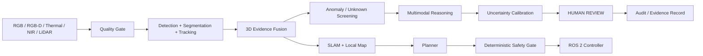

# Multimodal AI Architecture

```mermaid
flowchart LR
 A[RGB / RGB-D / Thermal / NIR / LiDAR] --> B[Quality Gate]
 B --> C[Detection + Segmentation + Tracking]
 C --> D[3D Evidence Fusion]
 D --> E[Anomaly / Unknown Screening]
 E --> F[Multimodal Reasoning]
 F --> G[Uncertainty Calibration]
 G --> H[HUMAN REVIEW]
 H --> I[Audit / Evidence Record]
 D --> J[SLAM + Local Map]
 J --> K[Planner]
 K --> L[Deterministic Safety Gate]
 L --> M[ROS 2 Controller]
```

Foundation models are review aids and **never connect directly to motors or actuators**.
